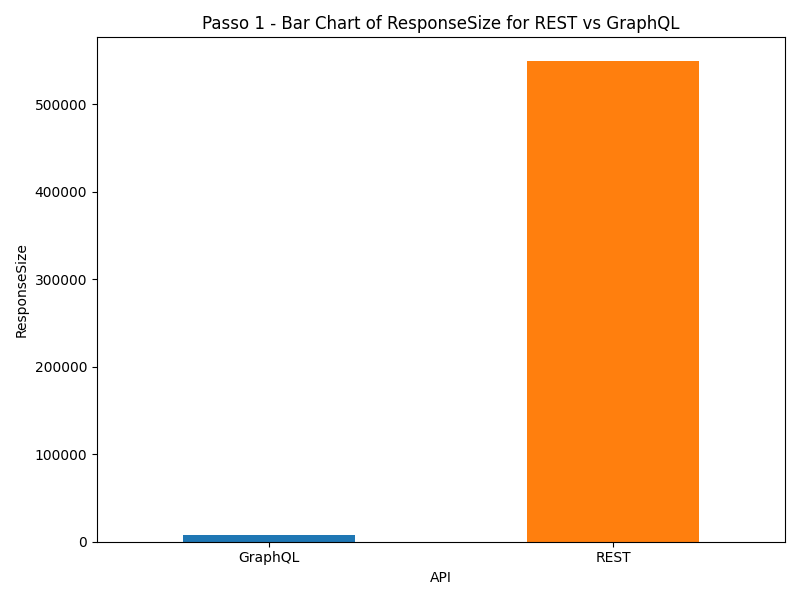
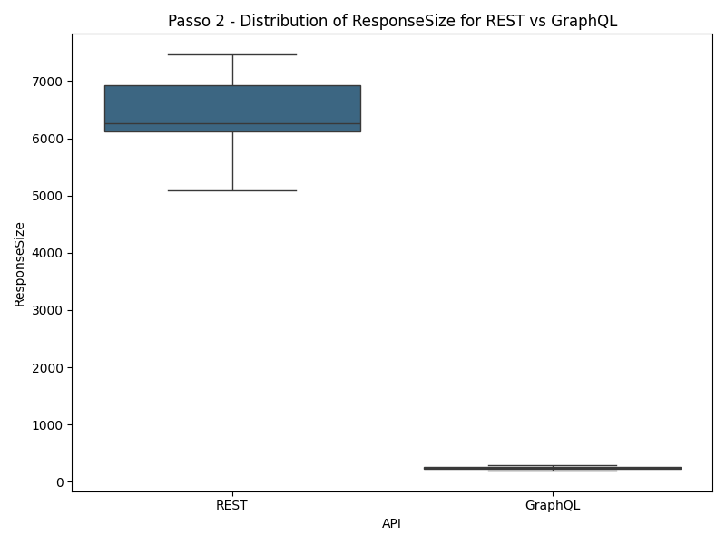

# Experimento de Comparação entre APIs REST e GraphQL do GitHub

Este experimento tem como objetivo avaliar quantitativamente os benefícios da adoção de uma API GraphQL em comparação com uma API REST. Em particular, serão respondidas as seguintes perguntas de pesquisa:

- **RQ1:** Respostas às consultas GraphQL são mais rápidas que respostas às consultas REST?
- **RQ2:** Respostas às consultas GraphQL têm tamanho menor que respostas às consultas REST?

## Metodologia

Para responder a essas perguntas, realizaremos um experimento controlado utilizando consultas REST e GraphQL na API do GitHub. Abaixo estão os detalhes do desenho experimental.

### Desenho do Experimento

1. **Hipóteses:**

   - **Hipótese Nula (H0):** Não há diferença significativa na velocidade de resposta ou no tamanho das respostas entre as APIs REST e GraphQL do GitHub.
   - **Hipótese Alternativa (H1):** A API GraphQL do GitHub é mais rápida e/ou fornece respostas com menor tamanho do que a API REST do GitHub.

2. **Variáveis Dependentes:**

   - **Tempo de resposta** (ms): Tempo entre o envio da consulta e o recebimento completo da resposta.
   - **Tamanho da resposta** (bytes): Tamanho total dos dados retornados em cada consulta.

3. **Variáveis Independentes:**

   - **Tipo de API**: REST vs. GraphQL.
   - **Tipo de consulta**: Diferentes endpoints para dados equivalentes nas duas APIs.
   - **Tipo de Params**: Size, filters e etc

4. **Tratamentos:**

   - **Consulta REST**: Usando endpoints REST específicos da API do GitHub.
   - **Consulta GraphQL**: Usando consultas equivalentes na API GraphQL.

5. **Objetos Experimentais:**

   - **Instância t2.micro da AWS EC2**: Para realizar as consultas em um ambiente controlado.

6. **Tipo de Projeto Experimental:**

   - **Projeto Fatorial**

7. **Quantidade de Medições:**

   - Serão realizadas entre **100 medições** para cada endpoint em ambas as APIs para obter uma média estatisticamente significativa.

8. **Ameaças à Validade:**
   - **Validade Interna:** Variabilidade de rede pode afetar o tempo de resposta. Realizaremos consultas alternadas e repetidas para reduzir essa variabilidade.
   - **Validade Externa:** Resultados podem não se generalizar para outras APIs REST e GraphQL além do GitHub.

## Endpoints Selecionados

Para garantir comparabilidade, os endpoints selecionados nas APIs REST e GraphQL do GitHub devem fornecer dados equivalentes.

### API REST

#### Passo 1: Pegar os 100 repositórios mais famosos

1. **Rest API** `/search/repositories?q=stars:>1&sort=stars&order=desc&per_page=100`

2. **GraphQL API Query**:
   ```graphql
   query {
     search(query: "stars:>1", type: REPOSITORY, first: 100) {
       nodes {
         ... on Repository {
           name
           owner {
             login
           }
           stargazerCount
         }
       }
     }
   }
   ``
   ```
3. Chamar cada endpoint 100 vezes e calcular
   - Média
   - Mediana
   - Tamanho da response

#### Passo 2; Pegar informações de 10 repositórios aleatórios dos top 100

1. .**Rest API** `/repos/{owner}/{repo}`

2. **GraphQL API Query**:

```graphql
query {
  repository(owner: "{owner}", name: "{repo}") {
    name
    description
    stargazerCount
    forkCount
    issues {
      totalCount
    }
    createdAt
  }
}
```

3. Chamar cada endpoint 100 vezes e calcular
   - Média
   - Mediana
   - Tamanho da response

## Resultados

### Passo 1 - Análises 100 repositórios mais famosos

A partir da análise da média e da mediana dos tempos de resposta, percebe-se que a API GraphQL tende a ser um pouco mais rápida


Por fim, o tamanho médio da resposta é muito maior para requisições REST, se comparado a requisições GraphQL



### Passo 2 - Análises 10 repositórios aleatórios

Analisando a distribuição das médias e das medianas dos tempos de resposta, nota-se que, para o endpoint escolhido, a API GraphQL possui tempos significantemente menores


Finalmente, assim como no passo 1, o tamanho das respostas em GraphQL são muito menores em relação a consultas REST



## Conclusão

O experimento comparou as APIs REST e GraphQL do GitHub em termos de tempo de resposta e tamanho da resposta para avaliar suas vantagens e desvantagens.
Os resultados indicaram que:

- A API GraphQL foi significativamente mais rápida e retornou respostas menores em comparação com a API REST.
- A GraphQL permitiu uma maior flexibilidade ao retornar apenas os dados solicitados, reduzindo o tempo de resposta e o tamanho das respostas, enquanto a API REST retornou dados adicionais desnecessários.
